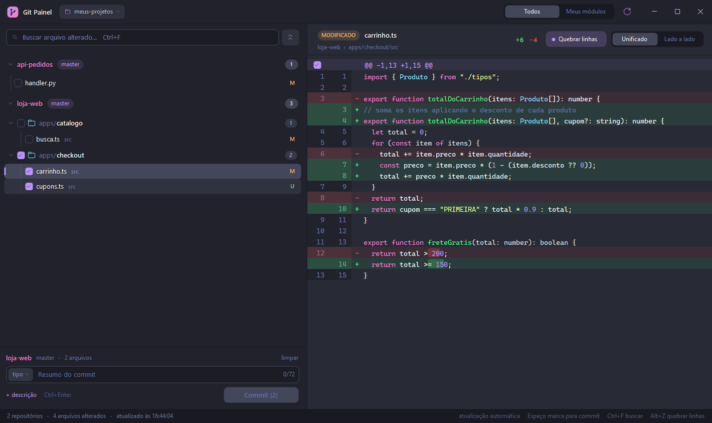

# Git Painel

Painel desktop para Windows que mostra, numa tela só, as alterações de **todos os repositórios Git de uma pasta**, com diff, commit, histórico, push e pull. Serve para quem trabalha com vários projetos lado a lado (por exemplo, usando o Claude Code numa pasta pai) e quer ver o que mudou sem abrir o VS Code.



- **Leve e portátil:** um único `.exe` de ~160 KB, sem instalação e sem Node, Electron ou servidor.
- **Tema Dracula:** interface escura desenhada à mão, com rolagem suave.

## Funcionalidades

**Visualização**
- Lista os repositórios encontrados na pasta escolhida, com branch e botões de sincronização (`↑ Enviar`, `↓ Atualizar`, `Publicar`).
- Agrupa os arquivos por **módulo**: pastas com `package.json`, `serverless.yml`, `requirements.txt`, `pyproject.toml` e parecidos. Ex.: `apps/cadastro`.
- **Meus módulos:** marque módulos com estrela e filtre só os seus.
- **Diff:** unificado ou lado a lado, quebra de linha, cores de sintaxe (TS/JS, JSON, Python, SQL, C#, CSS, YAML) e realce das palavras que mudaram.
- Seleção e cópia de código no diff.
- Busca de arquivos, expandir e recolher tudo.
- Atualização automática quando arquivos mudam; respeita o `.gitignore`.

**Commit e sincronização**
- Marque arquivos, módulos inteiros ou **só alguns trechos** de um arquivo para o commit.
- Painel de commit compacto, com tipo e escopo no padrão Conventional Commits (com ou sem emoji), detectado a partir do histórico do repositório.
- Desfazer o último commit ainda não enviado; nada é perdido.
- Push e pull com confirmação.
- Branches divergentes (os dois lados com commits novos): o app oferece juntar com um merge, avisando antes se vai haver conflito; conflitos são resolvidos no VS Code e concluídos (ou cancelados) pelo app.
- Histórico de commits do repositório ou de um módulo, com o diff de cada arquivo.
- Erros do Git explicados em português.

**Atualização automática**
- O app avisa discretamente quando há versão nova nas Releases e se atualiza com um clique, mantendo as preferências.

**Integrações**
- Botão direito: abrir no Explorador de Arquivos, Bloco de Notas ou VS Code; copiar caminho.
- Duplo clique num arquivo abre no VS Code.

## Requisitos

- Windows 10 ou 11.
- [Git](https://git-scm.com/) instalado e no `PATH`.
- VS Code (opcional, só para "Abrir no VS Code").

O app usa o .NET Framework 4.8, que já vem no Windows.

## Como usar

1. Baixe o `GitPainel.exe` em **Releases** (ou compile, veja abaixo).
2. Abra o exe e escolha a pasta que contém seus projetos.
3. As preferências (pasta, favoritos, tamanho da janela) ficam em `GitPainel.ini`, ao lado do exe.

> Como o exe não é assinado digitalmente, o Windows pode mostrar "O Windows protegeu o computador" na primeira vez. Clique em **Mais informações → Executar assim mesmo**.

## Atalhos

| Atalho | Ação |
|---|---|
| F5 | Atualizar |
| Ctrl+F | Buscar arquivo (↓ ou Enter vai para a lista) |
| Ctrl+O | Trocar de pasta |
| Espaço | Marcar/desmarcar o arquivo selecionado para o commit |
| Ctrl+Enter | Fazer o commit |
| Ctrl+↓ / Ctrl+↑ | Expandir / recolher tudo |
| Alt+Z | Quebrar linhas no diff |
| Ctrl+C | Copiar o código selecionado (no diff) ou o caminho do arquivo (na lista) |
| Ctrl+A | Selecionar todo o diff |

## Publicar uma versão nova

1. Suba o número em `src/Tema.cs` (`AssemblyVersion`).
2. Compile e crie uma release com a tag `v` + número (ex.: `v1.2.0`), anexando o `GitPainel.exe` com esse nome.
3. Quem já usa o app recebe o aviso em até 6 horas, ou na próxima vez que abrir.

## Compilar

Não precisa instalar nada: o `compilar.bat` usa o compilador C# que já vem no Windows.

```bat
compilar.bat
```

O `GitPainel.exe` é gerado na mesma pasta.

## Estrutura

| Arquivo | Conteúdo |
|---|---|
| `src/Tema.cs` | Paleta Dracula, fontes, desenho e chamadas ao Windows |
| `src/Git.cs` | Modelos e todas as chamadas ao `git` |
| `src/Lista.cs` | Lista lateral de repositórios, módulos e arquivos |
| `src/Diff.cs` | Visualizador de diff |
| `src/Sintaxe.cs` | Realce de sintaxe |
| `src/Historico.cs` | Painel de histórico de commits |
| `src/Commit.cs` | Painel de commit |
| `src/Controles.cs` | Botões, barras, diálogos e rolagem suave |
| `src/Menu.cs` | Menus do botão direito |
| `src/Atualizador.cs` | Verificação e instalação de versões novas (Releases do GitHub) |
| `src/MainForm.cs` | Janela principal, atualização automática da lista e operações |

O histórico de funcionalidades está em [CHANGELOG.md](CHANGELOG.md).

## Licença

[MIT](LICENSE): pode usar, modificar e distribuir livremente, mantendo o aviso de copyright.
